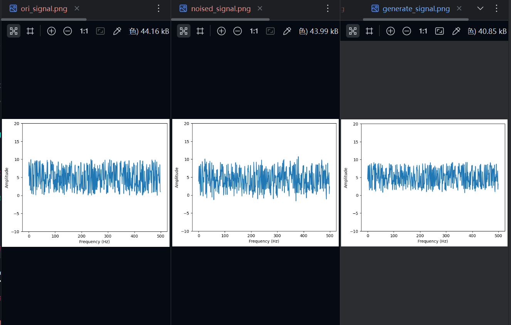

# signal_recover-diffusion
A project for recovering signals from noise.



## Installation

To install the project, you need:

1. `git clone git@github.com:DXWK73/signal_recover_diffusion.gitt`
2. `conda create --name sgr python=3.10`
4. `conda activate sgr`
5. `pip install -r requirements.txt`

## Train

To train yourself datas, you need:

1.Put your data into `/data/same_datas`

2.Run train.py
```commandline
python train.py --epochs 512 --lr 1e-3 --batch_size 4 --device cuda:0
```  

3.When the train process finish, your model weight will be saved at `ckpt\sgr\model.pth`

4.Train finish.

## Inference

To inference the model for generating signals, you need:

1.Run infer.py
```commandline
python infer.py
```

2.Then an img and .txt file will be saved at `examples`

3.Inference finish.

## Eval

To Eval the model for generating signals, you need:

1.Run infer.py
```commandline
python eval.py
```

2.Then an img and .txt file will be saved at `examples`

3.Inference finish.